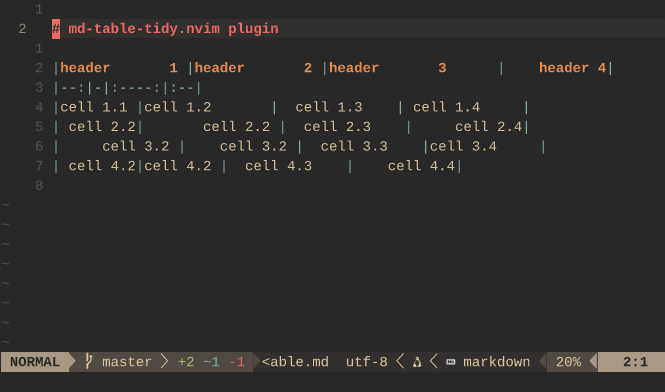

# md-table-tidy.nvim

A lightweight Neovim plugin for formatting markdown tables.
Just place your cursor anywhere inside a markdown table and trigger the formatter — it aligns pipes, cells, and headers for clean and readable output.



## Features
- Formats markdown tables to align pipes and columns
- Optional: add padding to cells for better readability

## Requirements
- [nvim-treesitter](https://github.com/nvim-treesitter/nvim-treesitter)
- Tree-sitter parser for `markdown` (`:TSInstall markdown`)

## Setup
### Using [lazy.nvim](https://github.com/folke/lazy.nvim)
```lua
return { "timantipov/md-table-tidy.nvim",
    -- default config
    opts = {
      padding = 1,        -- number of spaces for cell padding
      key = "<leader>tt", -- key for command :TableTidy<CR>
    }
}
```
## Usage
Just hit `<leader>tt` or execute command `:TableTidy` on table under cursor
## License
[MIT](./LICENSE)
